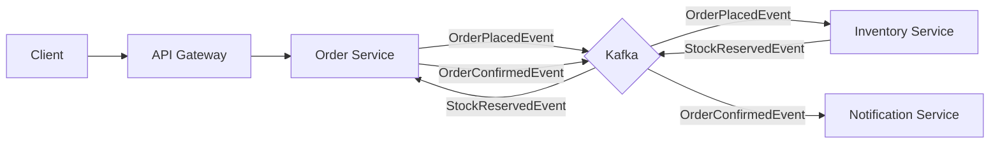

# Distributed E-Commerce Microservices System

> **A production-grade, event-driven microservices architecture** built with Spring Boot, Spring Cloud, Kafka, and React. demonstrating enterprise-level design patterns, scalability, and resilience.

---

## 🏗️ System Architecture

The system follows a **Database-per-Service** pattern with **Event-Driven Communication**.

### Core Microservices
| Service | Port | Description |
|---------|------|-------------|
| **Discovery Server** | `8761` | Netflix Eureka Service Registry |
| **API Gateway** | `8080` | Spring Cloud Gateway (Entry Point, Security) |
| **Order Service** | `8081` | Order Management (Circuit Breaker, Retry) |
| **Inventory Service** | `8082` | Stock Management (Pessimistic Locking) |
| **Notification Service** | `8083` | Email Notifications (Kafka Consumer) |
| **Frontend** | `3000` | React + Vite UI |

### Event Flow


---

## 🛠️ Technology Stack

| Layer | Technologies |
|-------|-------------|
| **Backend** | Java 17, Spring Boot 3.2, Spring Cloud 2023 |
| **Frontend** | React, Vite, TypeScript, TailwindCSS |
| **Database** | PostgreSQL (Multiple Instances) |
| **Messaging** | Apache Kafka, Zookeeper |
| **Security** | Keycloak (OAuth2/OIDC), JWT |
| **Resilience** | Resilience4j (Circuit Breaker, Rate Limiter) |
| **Observability** | Zipkin (Tracing), Prometheus, Grafana, Loki |
| **DevOps** | Docker, Docker Compose |

---

## ✨ Key Features

1.  **Event-Driven Architecture**: Asynchronous communication using Apache Kafka to decouple services.
2.  **Resilience Patterns**: Implements **Circuit Breaker**, **Retry**, and **Rate Limiting** to handle failures gracefully.
3.  **Advanced Security**: **OAuth2/OIDC** authentication using Keycloak as an Identity Provider.
4.  **Distributed Tracing**: Full visibility into request lifecycles across microservices using **Zipkin**.
5.  **Concurrency Control**: **Pessimistic Locking** in Inventory Service to prevent race conditions during high traffic.
6.  **Centralized Logging**: Aggregated logs using **Grafana Loki**.

---

## 🎓 Enterprise Patterns Demonstrated
- [x] Microservices Architecture
- [x] API Gateway Pattern
- [x] Service Discovery (Eureka)
- [x] Database per Service
- [x] Saga Pattern (Choreography)
- [x] Distributed Tracing
- [x] Externalized Configuration

---

## 🚀 Quick Start (Local Development)

### Prerequisites
- Docker & Docker Compose
- Java 17+
- Node.js 18+

### 1. Start Infrastructure
Run the supporting services (Databases, Kafka, Keycloak, Zipkin):
```bash
docker-compose up -d zookeeper kafka postgres redis zipkin keycloak grafana loki
```
*Wait ~30 seconds for services to initialize.*

### 2. Start Microservices
Start the Spring Boot applications in this **exact order**:
1.  **Eureka Server**
2.  **API Gateway**
3.  **Inventory Service**
4.  **Order Service**
5.  **Notification Service**

### 3. Start Frontend
```bash
cd frontend
npm install
npm run dev
```
**Access the UI:** [http://localhost:5173](http://localhost:5173)

---

## 🧪 API Testing

### Add Product (Inventory)
```bash
curl -X POST http://localhost:8080/api/inventory \
  -H "Content-Type: application/json" \
  -d '{
    "name": "Gaming Laptop",
    "description": "High-performance rig",
    "price": 1200.00,
    "stockQuantity": 10
  }'
```

### Place Order
```bash
curl -X POST http://localhost:8080/api/orders \
  -H "Content-Type: application/json" \
  -d '{
    "userId": "user123",
    "productId": 1,
    "quantity": 1
  }'
```

---

## 📊 Monitoring

- **Service Registry:** [http://localhost:8761](http://localhost:8761)
- **Distributed Tracing:** [http://localhost:9411](http://localhost:9411)
- **Keycloak Admin:** [http://localhost:8090](http://localhost:8090)

---

## License
MIT

---
Created by **Abhay Kotnala**
